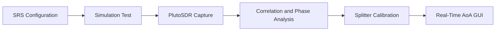
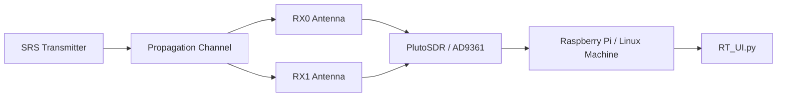
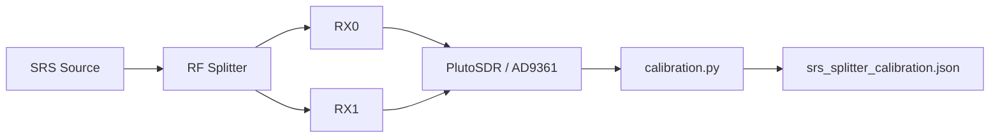

# PlutoSDR SRS Angle of Arrival


Real-time Angle of Arrival (AoA) estimation using LTE Sounding Reference Signal
(SRS) correlation on two coherent receive channels from a PlutoSDR /
AD9361-compatible SDR.

The project starts with LTE SRS sequence generation and simulation, then moves
to real PlutoSDR capture, splitter-based phase calibration, and a final real-time
GUI in `RT_UI.py`.

## Final Result

`RT_UI.py` estimates the incoming signal direction in real time by:

1. Detecting SRS peaks through correlation.
2. Estimating RX0/RX1 phase difference.
3. Subtracting splitter-based hardware calibration phase.
4. Converting corrected phase difference into an AoA estimate.

## Project at a Glance

| Item | Value |
|---|---|
| SDR target | PlutoSDR / AD9361-compatible SDR |
| Receive setup | 2 coherent RX channels |
| Reference signal | LTE Sounding Reference Signal |
| Calibration | Splitter-based RX0/RX1 phase calibration |
| Final script | `RT_UI.py` |
| Output | Real-time AoA estimate with GUI |
| Default SDR URI | `ip:192.168.2.1` |

## Workflow



## Hardware Setup



For calibration, replace the two antennas with a splitter so RX0 and RX1 receive
the same signal:



## Hardware Requirements

- PlutoSDR or AD9361-compatible SDR
- Two RX channels available at the same time
- Two antennas for AoA measurements, or a splitter setup for calibration
- Raspberry Pi or Linux machine connected to the SDR

## Software Requirements

- Python 3
- `numpy`
- `scipy`
- `matplotlib`
- `pyadi-iio`
- `sympy`
- `tkinter` for `RT_UI.py`

`tkinter` is usually provided by the operating system instead of `pip`. On
Debian, Ubuntu, or Raspberry Pi OS, install it with `sudo apt install python3-tk`
if it is missing.

## Installation

Create a virtual environment and install the Python dependencies:

```bash
python3 -m venv .venv
source .venv/bin/activate
python -m pip install --upgrade pip
python -m pip install -r requirements.txt
```

Install the Analog Devices IIO system libraries if `pyadi-iio` cannot connect to
the SDR. On many Linux systems this means installing `libiio` and `libad9361-iio`
from the OS package manager.

## PlutoSDR Connection

The scripts assume the SDR is reachable at:

```python
ip:192.168.2.1
```

If your SDR uses a different address, update the Pluto/AD9361 constructor in the
scripts you run. For example:

```python
sdr = adi.ad9361(uri="ip:192.168.2.1")
```

or, in the earlier Pluto-only script:

```python
sdr = adi.Pluto("ip:192.168.2.1")
```

The current hard-coded IP appears in `pluto_srs_receive_corr.py`,
`realCaptureV1.py`, `capturteV2.py`, `calibration.py`, and `RT_UI.py`.

## Repository Structure

```text
.
├── README.md
├── requirements.txt
├── .gitignore
├── srs_config.py
├── test_srs_sim.py
├── pluto_srs_receive_corr.py
├── realCaptureV1.py
├── capturteV2.py
├── calibration.py
├── srs_splitter_calibration.json
└── RT_UI.py
```

## Project Files

- `srs_config.py`: LTE SRS configuration and sequence generation shared by the
  simulation, capture, calibration, and UI scripts.
- `test_srs_sim.py`: simulation test for SRS detection by correlation without
  SDR hardware.
- `pluto_srs_receive_corr.py`: early PlutoSDR receive and correlation test.
- `realCaptureV1.py`: real capture experiment that detects SRS peaks and
  estimates RX phase difference.
- `capturteV2.py`: improved capture/correlation version with additional quality
  checks and weighted phase statistics. The filename appears to be a typo, but
  it is kept as-is for compatibility.
- `calibration.py`: splitter-based phase calibration for RX0/RX1 hardware phase
  offset.
- `srs_splitter_calibration.json`: saved calibration result used by the
  real-time UI.
- `RT_UI.py`: final real-time AoA GUI.

## Recommended Usage

1. Run the simulation:

   ```bash
   python test_srs_sim.py
   ```

2. Test PlutoSDR connection and SRS capture:

   ```bash
   python pluto_srs_receive_corr.py
   ```

3. Run a fuller real capture/correlation check:

   ```bash
   python capturteV2.py
   ```

4. Connect a splitter so the same signal feeds RX0 and RX1, then run calibration:

   ```bash
   python calibration.py
   ```

5. Run the real-time AoA GUI:

   ```bash
   python RT_UI.py
   ```

## Calibration

Calibration uses a splitter to feed the same signal into RX0 and RX1. Since both
channels see the same signal, the true physical phase difference should be zero.
Any measured phase offset is treated as the SDR/cable/splitter hardware phase
offset and is saved in `srs_splitter_calibration.json`.

`RT_UI.py` loads that file and subtracts the saved calibration phase before
converting phase difference to AoA. If the file is missing, the UI falls back to
`0 rad` calibration and prints a warning.

## AoA Method

The receiver builds a local time-domain SRS symbol from `srs_config.py`, then:

1. Detects SRS peaks by correlation on RX0 and RX1.
2. Extracts the useful OFDM symbol around each detected peak.
3. Estimates the complex channel on each RX channel.
4. Computes the RX1-RX0 phase difference.
5. Subtracts the splitter calibration phase.
6. Converts corrected phase difference to angle using antenna spacing and
   wavelength.

The AoA conversion uses:

```text
theta = asin(corrected_phase * wavelength / (2*pi*antenna_spacing))
```

## Configuration

The main constants are near the top of the capture, calibration, and UI scripts:

- `sample_rate`: SDR sample rate. Current real-capture value is `5e6`.
- `center_freq`: RF center frequency. Current real-capture value is `886.6e6`.
- `rx_bw`: RX RF bandwidth. Current value is `3.84e6`.
- `N_FFT`: OFDM FFT size. Current value is `512`.
- `CP_LEN`: cyclic prefix length used by the local SRS symbol. Current value is
  `18`.
- `ANTENNA_SPACING_M`: antenna spacing in `RT_UI.py`. The default is
  `wavelength / 2`; replace it with the measured spacing if different.
- `RX_GAIN_CH0` and `RX_GAIN_CH1`: manual RX hardware gains. Current value is
  `30.0 dB` for both channels.

The SDR/SRS parameters in these scripts must match the transmitter waveform.

## Troubleshooting

### PlutoSDR Not Found

- Confirm USB/Ethernet connectivity and that the SDR is reachable at
  `ip:192.168.2.1`.
- If your SDR uses another address, update the `adi.Pluto(...)` or
  `adi.ad9361(...)` constructor.
- Check that the IIO drivers and system libraries are installed.

### Two RX Channels Not Available

- Confirm your hardware/firmware exposes both RX channels.
- The main scripts use `sdr.rx_enabled_channels = [0, 1]`.
- Some PlutoSDR setups require AD9361-compatible dual-channel support.

### Low Correlation Quality

- Verify `sample_rate`, `center_freq`, `rx_bw`, `N_FFT`, `CP_LEN`, and SRS
  settings match the transmitter.
- Check gain values and avoid ADC clipping.
- Reduce cable/antenna loss or improve signal level.

### No SRS Peaks Detected

- Confirm the transmitter is sending the expected SRS.
- Lower `PEAK_HEIGHT_THRESHOLD` only after checking signal level and parameter
  matching.
- Check that `MIN_PEAK_DISTANCE_MS` matches the SRS period.

### Wrong Angle Sign

- Swap the RX0/RX1 antenna inputs or invert the sign convention in the AoA
  calculation.
- The UI labels positive angle as right and negative angle as left.

### Calibration File Missing

- Run `python calibration.py` with the splitter setup connected.
- Confirm `srs_splitter_calibration.json` remains in the same directory as
  `RT_UI.py`.

## Limitations

- Assumes two coherent RX channels.
- Assumes correct antenna spacing.
- Phase ambiguity occurs if spacing is too large, especially above half a
  wavelength.
- Multipath can bias the phase difference and affect AoA.
- SDR and SRS parameters are hard-coded and must match the transmitter.
- The calibration JSON is hardware/setup-specific; rerun calibration after
  changing cables, splitter, SDR, frequency, or antennas.

## Suggested Visuals

For a stronger presentation, add these images under an `assets/` folder and link
them near the top of this README:

- `assets/rt_ui.png`: screenshot of the real-time AoA GUI.
- `assets/correlation_peaks.png`: plot showing detected SRS correlation peaks.
- `assets/calibration_result.png`: plot or terminal screenshot showing the final
  splitter calibration phase and coherence.
